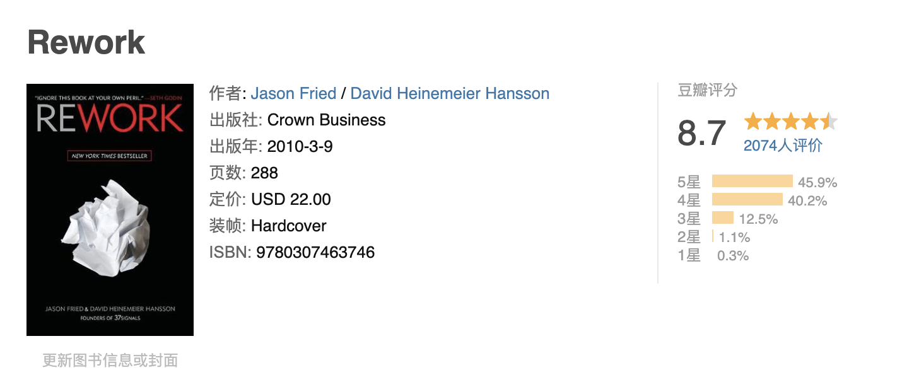

Title: Reading Notes -- Rework By Jason Fried and David Heinemeier Hansson
Date: 2023-09-21 16:20
Modified: 2023-09-21 16:20
Category: ReadingNotes
Authors: minyakonga
Summary:  The book let me realized that for many years, we have been doing something totally wrong, to keep efficient at work, you need read through the book, which will cover many aspects.

Here are some aspects we have that I think opposite with the book opinions.

> Problems start when you have more people than you need. you start inventing works to keep everyone busy.

We have lot's of projects which are not tight related to our core bussiness, for example, data center platform which is used to store logs and display it with charts, easy flow system which is a low-code platform, log audit system which is used to display product usage data, security detect system, etc, there are lots of similiar projects in our company. we are inventing the wheels, what worse is that these wheels are buggy.

Due to not need to consider the costs, our boss will keep hiring people, make his teams seems big, trying inventing lot's of works to keep everybody busy. thus make himself looks important in the big  company. Maybe Chinese want others see themself big.

> Years of experience == Years of irrelevance.  there is surprisingly little difference between a candidate with six months of experience and one with six years. the real difference comes from the individual's dedication, personality, and intelligence.

When you work couple of years you will notice this is true, 3 years of experience actaully equals 3 monthes, becuase you are repeating yourself during the rest of the time. If you don't break the repeatition pattern by your dedication, personality and intelligence, you are then replaceable.

> Think about it, when do you get your most work done? If you are like most people, it is  early morning or night. It's no coincidence that these are times when nobody else are around. So interruptions are not collaborations, it's enemy of productivity, when you are interrupted you are not getting works done.

Can't aggree more, Used to bothered by the meetings, talkings, standups conversations when I worked in Tencent, and also there are new group chats that invites you in which need to do some upgrade works from time to time. the result is that I can't deliver the feature as promissed without working late night or weekends.

> We design them to be simple because we believe most software is too complex: too many features, too many buttons, too much confusion. so we build software that's the opposite of that. if what we make isn't right for everyone, that's okay. we're willing to lose some customers if it means that others love our product intensely.

In Unix, there is KISS, Keep It Simple Stupid. the products in our department or most of product in China are not following this principle, they want to be everything, they are difficult to use, that is why I don't  use our department's data platform, cuz it sucks.

> Workaholics wind up creating more problems than they solve. first off, working like that just isn't sustainable over time. second, missing the point which tries to fix problems by spending extra hours instead of smarter solutions. third, it creates crisis.

I used to be workaholic, now I give up on that, cuz feels it meaningless, and the more you do, the higher possibility you will make mistakes, and thus everyone remembers you, especially your mistakes. and also most of the works are not that nessecerry if you think it deeply: why do we do this? Is there a better way? Is it really nessecery?

> Writing a plan makes you feel in control of things you can't actually control, why don't we just call plans what they really are: Guesses.     start referring to your business plans as business guesses. plans let the past drive the future, you have the most information when you're doing something, not before you've done it. yet when you do write a plan? Usually it's before you've even begun. that's the worst time to make a big decision.

We have a OKR, which need us set the plan or goal at the begining of the year, but I found we can never follow the plan, cuz there are always something more priority, and we forget the plan or goal we set at begining, it bothers me cuz the management system need us set plan but no one check the result based on the plan!!!

There are much more, I highly recomment the book, which is short but informative.
